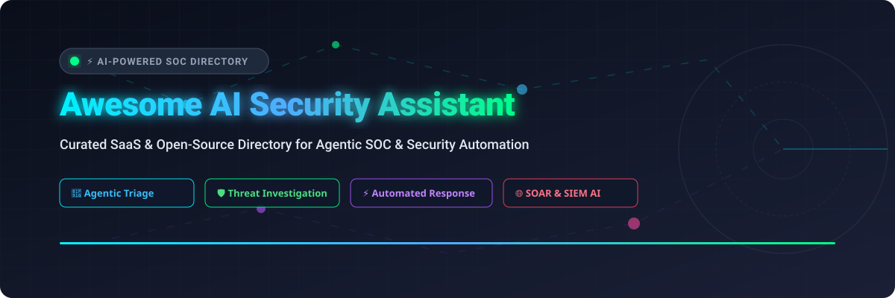

<p align="center">
  <a href="https://github.com/ishandutta2007/Awesome-Awesome-Awesome"></a><a href="https://discord.gg/jc4xtF58Ve"></a>
  
  
  
  
  <a href="https://github.com/ishandutta2007"></a>
</p>

<p align="center">
  
</p>

# 🛡️ Awesome AI Security Assistant & Agentic SOC Directory 🤖

[](https://github.com/ishandutta2007/Awesome-Awesome-Awesome)

> **A curated collection of top enterprise SaaS platforms and open-source GitHub projects for AI Security Assistants, Agentic SOCs, Autonomous Alert Triage, Threat Investigation, and Automated Response (SOAR/SIEM).**

---

## 🔍 Overview & SEO Highlights

**AI Security Assistants** and **Agentic Security Operations Centers (SOC)** are transforming cyber defense. By replacing manual alert processing with LLM-powered reasoning agents, security teams drastically reduce **Mean Time to Detect (MTTD)** and **Mean Time to Respond (MTTR)**. 

This repository provides an up-to-date, comprehensive comparison of commercial SaaS solutions and self-hosted open-source software for:
- 🤖 **Agentic Incident Investigation & Alert Triage**
- ⚡ **Autonomous Playbook Execution & SOAR Integration**
- 🛡️ **Threat Intelligence Fusion & Security Model Tuning**
- 🔒 **Cloud Security Posture (CSPM/AI-SPM) & Exposure Management**

---

## 📑 Table of Contents

- [📊 Market Overview & Industry Structure](#-market-overview--industry-structure)
- [🏢 SaaS & Commercial AI Security Platforms](#-saas--commercial-ai-security-platforms)
- [🔓 Open-Source AI Security & SOC Projects](#-open-source-ai-security--soc-projects)
- [💡 Choosing the Right Solution](#-choosing-the-right-solution)
- [🤝 How to Contribute](#-how-to-contribute)
- [☕ Support & Sponsorship](#-support--sponsorship)
- [📈 Star History](#-star-history)
- [📜 Disclaimer](#-disclaimer)

---

## 📊 Market Overview & Industry Structure

> 💡 The global AI Security & Agentic SOC Assistant market size is estimated at **$24.5 Billion in 2026** and is projected to reach **$60+ Billion by 2030** (CAGR ~25%). The sector is **moderately concentrated** among major cybersecurity titans (Microsoft, Cisco, Palo Alto Networks, CrowdStrike, SentinelOne) while remaining dynamic with fast-growing specialized AI cloud and incident response platforms.

---

## 🏢 SaaS & Commercial AI Security Platforms

The following interactive comparison table highlights enterprise-grade SaaS platforms offering agentic security capabilities, sorted descending by total company market valuation / annual revenue.

| Product / Platform | Company & Valuation | Pricing / Starting Cost | Free Tier / Trial Limits | Key Capabilities & Best For |
| :--- | :--- | :--- | :--- | :--- |
| **[Microsoft Copilot for Security](https://securitycopilot.microsoft.com/)** | **Microsoft**<br>📊 `$3.1 Trillion` Valuation<br>💵 `$245B+` Revenue | **$4.00 – $6.00 / SCU / hr**<br>*(~$2,880–$4,320/mo per SCU baseline)* | **No permanent free tier**<br>*(400 SCUs/mo included free for M365 E5/E7 subscribers; 180-day trial for enterprise tenants)* | **Best for:** Microsoft E5/E7 enterprises.<br>Integrated across Defender, Intune, Purview & Entra. Multi-agent red/blue/green team remediation. |
| **[Cisco AI Assistant for Security](https://www.cisco.com/c/en/us/support/docs/security/secure-firewall-management-center/226077-configure-and-troubleshoot-ai-assistant.pdf)** | **Cisco Systems**<br>📊 `$200 Billion` Valuation<br>💵 `$54B+` Revenue | **$2,500 – $5,000 / FMC / yr**<br>*(Included in Cisco Security Cloud tier)* | **60-Day Free Trial**<br>*(Full evaluation license for Cisco FMC with AI Assistant enabled)* | **Best for:** Cisco firewall & network admins.<br>Translates natural language to firewall rules, diagnoses policy conflicts, real-time alert center. |
| **[Palo Alto Cortex XSIAM](https://www.paloaltonetworks.com/cortex/cortex-xsiam)** | **Palo Alto Networks**<br>📊 `$110 Billion` Valuation<br>💵 `$8.0B+` Revenue | **$10,000 / month** baseline<br>*(+$50–$90 per GB ingested/day)* | **30-Day Free Trial**<br>*(Up to 100 GB/day ingestion preview upon sales approval)* | **Best for:** Enterprise SOCs seeking native agentic playbooks.<br>Agentic Assistant trained on 1.2B playbook executions; native MCP server integration. |
| **[CrowdStrike Charlotte AI](https://www.crowdstrike.com/platform/charlotte-ai/)** | **CrowdStrike**<br>📊 `$75 Billion` Valuation<br>💵 `$3.9B+` Revenue | **$15 – $60 / endpoint / mo**<br>*(+$20/user/mo Charlotte AI add-on credit)* | **15-Day Free Trial**<br>*(CrowdStrike Falcon preview up to 100 endpoints with AI features)* | **Best for:** Falcon platform customers.<br>>98% decision accuracy on detection triage; AgentWorks no-code agent builder; ISO 42001 certified. |
| **[Splunk AI Assistant in Security](https://help.splunk.com/en/splunk-enterprise-security/8.4/administer/ai-assistant-in-security-and-agentic-capabilities)** | **Cisco / Splunk**<br>📊 `$28 Billion` Acquisition<br>💵 `$4.2B+` Revenue | **$1,800 / GB / day / yr**<br>*(~$15,000/yr starting enterprise tier)* | **60-Day Free Trial**<br>*(Splunk Cloud trial up to 5 GB/day ingestion with AI Assistant)* | **Best for:** Splunk ES cloud users.<br>Powered by Cisco Foundation-Sec-8B; automated SPL query generation, alert summaries, and MITRE mapping. |
| **[Wiz Defend AI (Blue Agent)](https://www.wiz.io/blog/wiz-blue-agent-generally-available)** | **Wiz**<br>📊 `$12 Billion` Valuation<br>💵 `$500M+` ARR | **$12,000 / year** starting tier<br>*(Included in Wiz Defend cloud platform)* | **14-Day Free Trial**<br>*(Up to 50 cloud workloads/nodes across AWS, Azure, GCP)* | **Best for:** Cloud-native incident response.<br>Autonomous Blue Agent triages cloud threats, specialized Forensics and Code Analysis sub-agents. |
| **[SentinelOne Purple AI](https://www.sentinelone.com/platform/purple-ai/)** | **SentinelOne**<br>📊 `$7.0 Billion` Valuation<br>💵 `$620M+` Revenue | **$18 – $36 / endpoint / yr**<br>*(Singularity Credit usage model)* | **30-Day Free Trial**<br>*(Includes 1,000 complimentary Singularity Credits for Purple AI)* | **Best for:** Zero-click autonomous endpoint investigation.<br>Handles 8,500+ daily autonomous investigations; multi-model setup (Claude, GPT, Ultraviolet). |
| **[Tenable ExposureAI](https://www.tenable.com/products/exposure-ai)** | **Tenable**<br>📊 `$5.0 Billion` Valuation<br>💵 `$850M+` Revenue | **$3,250 / year** starting tier<br>*(Up to 65 assets at ~$50/asset/yr)* | **30-Day Free Trial**<br>*(Tenable One trial for up to 100 assets)* | **Best for:** AI-SPM & Exposure Management.<br>Discovers shadow AI usage, maps access paths, identifies identity vulnerabilities & risky permissions. |
| **[Recorded Future AI](https://www.recordedfuture.com/platform/ai)** | **Recorded Future (Mastercard)**<br>📊 `$2.65 Billion` Acquisition<br>💵 `$300M+` ARR | **$25,000 / year** base suite<br>*(Includes AI Alert Filtering & Graph)* | **30-Day Free Trial**<br>*(Enterprise trial; free Recorded Future Express extension for light lookups)* | **Best for:** Threat intel alert prioritization.<br>Reduces raw alert volume by ~63% via Intelligence Graph; MCP server connects into any workflow tool. |

---

## 🔓 Open-Source AI Security & SOC Projects

Open-source projects offer self-hosted, air-gapped, and developer-centric building blocks for AI SOC automation. Sorted descending by GitHub Star Count ⭐.

### 🌟 Project Directory & Star Rankings

- **[Wazuh](https://github.com/wazuh/wazuh)** [](https://github.com/wazuh/wazuh/stargazers)  
  🛡️ **The Open Source Security Platform (XSIAM / SIEM / XDR).** Unified endpoint protection, vulnerability detection, and automated active response. Widely integrated with LLM agents and Wazuh MCP for automated triage.

- **[OpenCTI](https://github.com/opencti-platform/opencti)** [](https://github.com/opencti-platform/opencti/stargazers)  
  🌐 **Open Cyber Threat Intelligence Platform.** Structured threat intelligence platform (STIX2) designed to store, organize, and correlate cyber threat knowledge with AI context integration.

- **[MISP](https://github.com/MISP/MISP)** [](https://github.com/MISP/MISP/stargazers)  
  ⚡ **Open Source Threat Intelligence & Sharing Platform.** Open source software for collecting, storing, distributing, and sharing cybersecurity indicators and threat intelligence.

- **[TheHive](https://github.com/TheHive-Project/TheHive)** [](https://github.com/TheHive-Project/TheHive/stargazers)  
  📁 **Collaborative Security Incident Response Platform.** Seamlessly integrated with MISP and Cortex to enable rapid security case management, analyst task delegation, and AI workflow automation.

- **[Defguard](https://github.com/defguard/defguard)** [](https://github.com/defguard/defguard/stargazers)  
  🔒 **Zero-Trust Access Management & WireGuard MFA.** Enterprise-grade open-source WireGuard VPN, OpenID Connect SSO, and secure zero-trust gateway architecture.

- **[Shuffle](https://github.com/shuffle/shuffle)** [](https://github.com/shuffle/shuffle/stargazers)  
  🔀 **Open-Source Security Automation (SOAR).** General-purpose security automation platform featuring visual workflow building, OpenAPI auto-ingestion, and LLM agent node connectors.

- **[AiSOC](https://github.com/beenuar/AiSOC)** [](https://github.com/beenuar/AiSOC/stargazers)  
  🤖 **Open-Source AI SOC Platform.** MIT-licensed self-hostable AI SOC with alert fusion, LLM-agent triage, MITRE ATT&CK mapping,ClickHouse event lake, Neo4j entity graphs, and an immutable decision ledger.

- **[Allama](https://github.com/digitranslab/allama)** [](https://github.com/digitranslab/allama/stargazers)  
  ⚡ **Self-Hosted AI Security Automation & SOAR.** Visual drag-and-drop playbook builder, 80+ integrations (Splunk, Wazuh, CrowdStrike, Jira), WebAssembly sandbox execution, and local LLM support via Ollama.

- **[Sentora](https://github.com/d3vhex/Sentora)** [](https://github.com/d3vhex/Sentora/stargazers)  
  🚀 **Air-Gapped AI SIEM, EDR & SOAR.** Agent-based log ingestion via RabbitMQ, threat intel feed harvesting with staleness pruning, and dedicated air-gap mode (`THREAT_INTEL_MODE=off`).

- **[Security Shallots](https://github.com/benolenick/security-shallots)** [](https://github.com/benolenick/security-shallots/stargazers)  
  🧅 **Lightweight Python & SQLite SIEM Scout.** Runs on anything from a Raspberry Pi to dedicated servers. Zero Docker/Splunk requirement, auto-correlates Suricata, Syslog, and Wazuh feeds with optional AI triage.

- **[Agentic AI Security Operations Platform](https://github.com/golden-horizon/agentic-ai-security-operations-platform)** [](https://github.com/golden-horizon/agentic-ai-security-operations-platform/stargazers)  
  🧩 **Modular 8-Agent SOC Architecture.** Multi-agent workflow engine using Python, FastAPI, React, and Ollama/Qwen for threat enrichment, detection, severity escalation, and investigation.

- **[Amygdala](https://github.com/supernerve-dev/amygdala)** [](https://github.com/supernerve-dev/amygdala/stargazers)  
  🧠 **Agentic SOC Analyst via Splunk MCP.** Autonomous Splunk alert consumer powered by Foundation-Sec-8B that spawns investigation sub-agents for lateral movement analysis and risk scoring.

---

## 💡 Choosing the Right Solution

```
                            ┌─────────────────────────────────────────┐
                            │  What is your primary SOC requirement?  │
                            └────────────────────┬────────────────────┘
                                                 │
                   ┌─────────────────────────────┴─────────────────────────────┐
                   ▼                                                           ▼
       [Enterprise / Turnkey SaaS]                                   [Self-Hosted / Open Source]
                   │                                                           │
   ┌───────────────┴───────────────┐                           ┌───────────────┴───────────────┐
   ▼                               ▼                           ▼                               ▼
[Native EDR/SIEM Ecosystem]   [Best-of-Breed AI]           [Visual Workflow SOAR]       [Air-Gapped / Lightweight]
• MS Copilot for Security     • Wiz Defend AI              • Allama                     • Sentora
• CrowdStrike Charlotte       • Recorded Future AI         • Shuffle                    • Security Shallots
• Palo Alto Cortex XSIAM                                   • AiSOC                      • Wazuh + MCP
```

---

## 🤝 How to Contribute

Contributions are highly welcome! To add or update a project/platform:

1. 🍴 **Fork** this repository.
2. 📝 **Edit** `README.md` following the existing markdown table or open-source list schema.
3. 🔒 Ensure descriptions are factual, pricing details are specific, and links point directly to authoritative sources.
4. 🚀 **Open a Pull Request** with a concise explanation of your additions.

---

## ☕ Support & Sponsorship

If you find this repository helpful for your security research, SOC engineering, or AI evaluation, please consider supporting the project!

- ⭐ **Star** this repository to help others discover it.
- 🔀 **Fork** and share with your team or security community.
- ☕ **Buy Me a Coffee**: Support ongoing maintenance via [GitHub Sponsors](https://github.com/sponsors/ishandutta2007).

<a href="https://github.com/sponsors/ishandutta2007"></a>

---

## 📈 Star History

[](https://star-history.dera.page/#ishandutta2007/Awesome-AI-Security-Assistant&type=date&legend=top-left)

---

## 📜 Disclaimer

- This directory is **community-curated** for educational and research purposes.
- AI security assistants process sensitive telemetry and can execute response playbooks; always ensure proper RBAC, human approval gates, and compliance audits before production deployment.
